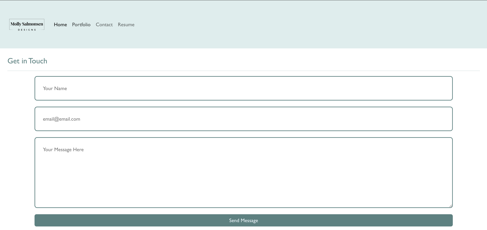

# React-Portfolio
Module 20: React Portfolio

## Deployed Link
add link here

### Preview

## Install
`npm start`

Runs the app in the development mode.\
Open [http://localhost:3000](http://localhost:3000) to view it in your browser.

The page will reload when you make changes.

## Notes
The Contact Form does NOT work. You can submit the form but it won't be received by anyone. 

## Technology Used:
* React
* Bootstrap
  
## Credit/Resources
* UofM Bootcamp office hours
* Various help from Youtube Video (https://www.youtube.com/watch?v=G-Cr00UYokU&ab_channel=EGATOR)